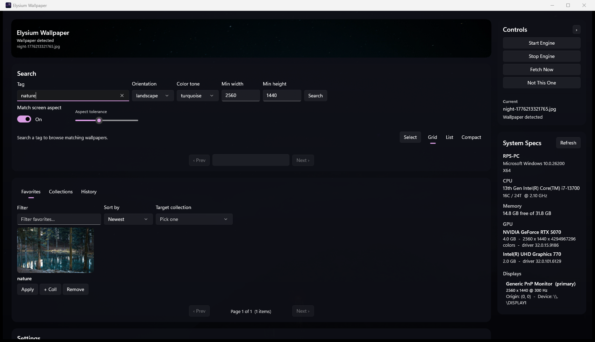

# Elysium Wallpaper

A Windows desktop wallpaper engine that picks the right image for the time of day — sunrise, midday, sunset, starry night — and rotates them automatically.



## What it does

- **Time-of-day rotation.** Splits the day into four user-editable slots and applies a wallpaper whose lighting fits the current slot. Bright sky at noon, deep violet horizon at sunset, low-key dark landscape at night — gated by per-slot luminance + histogram analysis so a midday image never sneaks into the 2am slot.
- **Multi-source library.** Pulls from [Pexels](https://www.pexels.com/) and [Openverse](https://openverse.org/) (commercial-use, modification-allowed filter), with seamless fallback when one rate-limits the other. Optionally walk a local folder.
- **Search & curate.** Tag search with orientation/color/aspect filters, paginated grid/list views, favorites, named collections, and per-slot history.
- **Per-monitor assignment.** On multi-monitor setups, fetch one aspect-matched image per display and apply each to its target.
- **System tray.** Close-to-tray with a right-click menu for quick reroll, previous wallpaper, start/stop engine, and exit.
- **Spec-aware defaults.** Reads CPU, GPU, RAM, and display topology on launch and pre-populates min-resolution, layout mode (Fill/Span/etc.), and thread budget without you touching anything.
- **Reroll.** Don't like the current pick? Hit "Not This One" and the engine pulls a fresh slot-appropriate image and forces an apply (with a timestamp-suffixed filename so Windows doesn't cache the path).

## Install

1. Download `ElysiumWallpaper-win-x64.zip` from [Releases](https://github.com/rps321321/elysium-wallpaper/releases) (or build from source — see below).
2. Unzip anywhere — it's self-contained, no .NET install required.
3. Double-click `ElysiumWallpaper.exe`.

ARM Windows: rebuild with `scripts\publish.ps1 -Rid win-arm64`.

## Quick start

1. Type a tag (`mountains`, `nebula`, `forest`, anything) into Search.
2. Press **Enter** or click **Search**. Browse the grid, click any thumbnail to preview, click **Apply** to set as wallpaper or **Save** to bookmark.
3. Click **Start Engine** in the right sidebar to enable automatic time-of-day rotation.
4. Optionally close the window — the app minimizes to the tray and keeps rotating.

The slot times (morning/noon/evening/night) are editable in **Settings**. Default boundaries: 06:00 / 12:00 / 17:00 / 20:00.

## Build from source

Requirements: Windows 10 1809+, .NET 10 SDK, Windows App SDK 1.x.

```powershell
git clone <repo>
cd elysium-wallpaper
dotnet build ElysiumWallpaper.WinUI/ElysiumWallpaper.csproj -c Debug -p:Platform=x64
```

Run from `ElysiumWallpaper.WinUI/bin/x64/Debug/net10.0-windows10.0.19041.0/win-x64/ElysiumWallpaper.exe`.

To produce a distributable zip:

```powershell
.\scripts\publish.ps1                    # win-x64 default
.\scripts\publish.ps1 -Rid win-arm64
```

Output lands in `dist/ElysiumWallpaper-<rid>.zip`.

To regenerate the app icons after editing `scripts/generate_icons.py`:

```powershell
python scripts/generate_icons.py
```

## Tests

```powershell
dotnet test ElysiumWallpaper.Tests -p:Platform=x64 -p:RuntimeIdentifier=win-x64
```

82 tests covering the pure services (slot resolution, time-of-day boundaries, manifest parsing, paged views, loop-delay computation).

## Architecture

WinUI 3 desktop app, .NET 10, MVVM via [CommunityToolkit.Mvvm](https://github.com/CommunityToolkit/dotnet).

```
ElysiumWallpaper.WinUI/
├── App.xaml.cs              # Entry, window lifecycle, crash log, icon
├── Views/                   # XAML pages + code-behind (handlers wrap async calls in SafeAsync)
├── ViewModels/
│   ├── MainViewModel.cs     # Fields, ctor, observable props, lifecycle
│   ├── ...Search.cs         # Pexels paging, filtering, prefetch
│   ├── ...Engine.cs         # Cycle loop, apply, recently-applied ring
│   ├── ...Library.cs        # Favorites, history, collections
│   └── ...Settings.cs       # Profile I/O, slot boundaries, system specs
├── Services/
│   ├── PexelsClient.cs              # Search API + downloader
│   ├── OpenverseClient.cs           # Pexels fallback (no key required)
│   ├── SlotAwareFetchService.cs     # Per-slot fetch with luma/histogram gates
│   ├── SlotImageResolver.cs         # Pick a file for the current slot
│   ├── TimeSlotService.cs           # Time → slot key + boundary math
│   ├── SlotManifest.cs              # Cache for slot→file mapping
│   ├── SlotBoundaries.cs            # Validated user-editable slot times
│   ├── SystemInfoService.cs         # CPU/GPU/RAM/displays via WMI + P/Invoke
│   ├── WallpaperService.cs          # SystemParametersInfo + IDesktopWallpaper COM
│   ├── MonitorFetchService.cs       # Per-monitor parallel fetch
│   ├── TrayService.cs               # H.NotifyIcon.WinUI tray icon + menu
│   ├── EngineLog.cs                 # Plain-text log under %LocalAppData%
│   └── PagedView.cs                 # Generic paged collection wrapper
├── Models/                  # FavoriteItem, HistoryItem, CollectionItem, etc.
├── Converters/              # XAML value converters (path → bitmap, timestamp → "Today", etc.)
└── Assets/                  # App icons (regenerable via scripts/generate_icons.py)
```

State persists to `%LocalAppData%\ElysiumWallpaper\`:

- `profile-<machine>-<resolution>.json` — per-machine settings, favorites, history, collections, recent tags
- `library/` — downloaded images (survive clean rebuilds and exe moves)
- `engine.log` — engine breadcrumbs
- `crash-log.txt` — last-resort crash dump

## Tech stack

| Concern | Library / API |
|---|---|
| UI framework | WinUI 3 (Windows App SDK 1.x) |
| MVVM | CommunityToolkit.Mvvm |
| Tray icon | H.NotifyIcon.WinUI |
| WMI | System.Management |
| Wallpaper apply | `SystemParametersInfo`, `IDesktopWallpaper` COM |
| Tests | xUnit |
| Image gen (icons) | Pillow (Python) |

## License

MIT — see [LICENSE](LICENSE).
